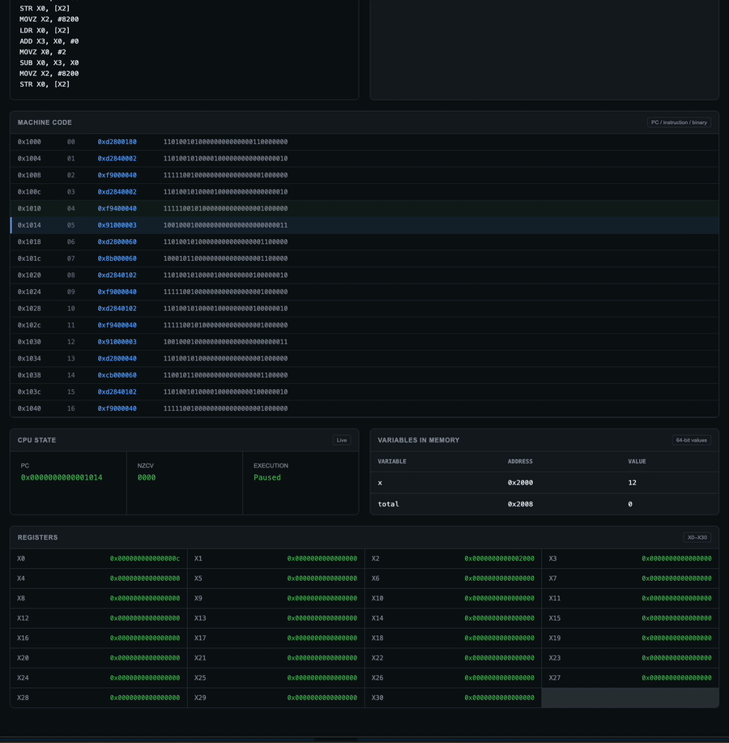

# Mini-A64

Mini-A64 is an educational 64-bit CPU, assembler and compiler inspired by the AArch64 architecture.

The project was built from scratch to understand what happens between writing source code and executing machine instructions:

```text
Mini source code
      ↓
   Compiler
      ↓
Mini-A64 Assembly
      ↓
   Assembler
      ↓
32-bit Machine Code
      ↓
 CPU Emulator
      ↓
Registers / Memory / Flags
```

## Live Playground

The complete toolchain runs directly in the browser through WebAssembly.

👉 **[Open Mini-A64 Playground](https://riwawa.github.io/mini_a64/)**

The playground allows you to:

- write programs in the Mini language;
- inspect generated assembly;
- inspect the symbol table;
- see the encoded 32-bit instructions;
- execute the program instruction by instruction;
- inspect registers, memory, PC and NZCV flags;
- run the CPU continuously with animated state changes;
- reset and replay execution.

> The web interface was intentionally kept simple and was built with basic HTML, CSS and JavaScript. I used AI assistance mainly to help finish and polish the interface so I could present the compiler, assembler and CPU work in an interactive way and make my learning process easier to visualize. The core systems concepts and implementation work are the main focus of this project.

---

## Why Mini-A64?

Mini-A64 is not intended to be a complete AArch64 implementation.

It is an educational architecture designed to explore:

- instruction encoding;
- CPU fetch/decode/execute cycles;
- registers and memory;
- condition flags;
- branches and control flow;
- assemblers;
- compilers;
- machine code;
- WebAssembly;
- low-level systems programming.

The architecture intentionally implements a smaller subset so each component can be understood and built incrementally.

---

# Mini Language

The project includes a small high-level language compiled directly to Mini-A64 assembly.

Example:

```txt
let x = 12
let total = x + 3
total = total - 2
```

The compiler currently supports:

```text
program     → { NEWLINE | statement } EOF

statement   → declaration
            | assignment

declaration → "let" IDENTIFIER "=" expression

assignment  → IDENTIFIER "=" expression

expression  → factor { ("+" | "-") factor }

factor      → NUMBER
            | IDENTIFIER
            | "(" expression ")"
```

Example generated assembly:

```asm
MOVZ X0, #12
MOVZ X2, #8192
STR X0, [X2]

LDR X0, [X2]
MOVZ X3, #3
ADD X0, X0, X3

MOVZ X2, #8200
STR X0, [X2]
```

---

# Architecture

## Registers

Mini-A64 currently provides:

```text
X0 - X30
```

31 general-purpose 64-bit registers.

```text
X0  uint64_t
X1  uint64_t
...
X30 uint64_t
```

The program counter is stored separately:

```text
PC
```

## Memory

The emulator uses:

```text
1 MiB byte-addressable memory
```

Programs are currently loaded at:

```text
0x1000
```

Compiler variables begin at:

```text
0x2000
```

Memory is little-endian.

## Condition Flags

Mini-A64 implements the traditional AArch64-style condition flags:

```text
N - Negative
Z - Zero
C - Carry
V - Overflow
```

Stored internally as:

```text
bit 3  bit 2  bit 1  bit 0

 N      Z      C      V
```

---

# Instruction Set

Mini-A64 currently implements an educational subset of A64.

## Arithmetic

```asm
ADD
ADDS
SUB
SUBS
```

Supported forms include:

```text
immediate
shifted register
extended register
```

## Logical

```asm
AND
ANDS
ORR
EOR
```

With immediate and shifted-register forms.

## Move Wide

```asm
MOVZ
MOVN
MOVK
```

## Memory

```asm
LDR
STR
```

64-bit loads and stores.

## Branches

```asm
B
BL
B.cond
BR
BLR
RET
```

Conditional branches use the NZCV flags.

---

# CPU Emulator

The CPU follows the classic execution cycle:

```text
FETCH
  ↓
DECODE
  ↓
EXECUTE
  ↓
UPDATE STATE
```

The execution engine exposes a single-instruction API:

```c
int cpu_step(void);
```

Continuous execution is implemented using the same primitive:

```c
while(!cpu_finished()){
    cpu_step();
}
```

This keeps single-step execution and continuous execution based on the same CPU logic.

---

# Visual Debugger

The browser interface exposes the internal state of the virtual machine.

During execution you can inspect:

```text
PC
NZCV
X0-X30
variables in memory
current machine instruction
```

### Step

`Step` executes exactly one machine instruction.

Example:

```text
PC = 0x1000

MOVZ X0, #12
```

After one step:

```text
X0 = 12
PC = 0x1004
```

### Run

`Run` repeatedly invokes the same `cpu_step()` function while updating the interface between instructions.

This makes register and memory mutations visible while the program executes.

---

# Project Structure

```text
mini_a64/
│
├── compiler/
│   ├── lexer.c
│   ├── parser.c
│   ├── symbol_table.c
│   ├── emitter.c
│   └── web_api.c
│
├── assembler/
│   ├── lexer.c
│   ├── parser.c
│   ├── assembler.c
│   ├── encoder.c
│   ├── symbol_table.c
│   └── web_api.c
│
├── cpu/
│   ├── cpu.c
│   ├── cpu.h
│   └── web_api.c
│
├── docs/
│   ├── index.html
│   ├── style.css
│   ├── app.js
│   └── wasm/
│
├── programs/
├── tests/
└── Makefile
```

---

# Building

The native components can be built with a C compiler.

The browser version uses Emscripten to compile the C components to WebAssembly:

```text
C
↓
Emscripten
↓
WebAssembly
↓
Browser
```

The web application loads three independent WASM modules:

```text
Compiler WASM
Assembler WASM
CPU WASM
```

---

# Web Architecture

```text
                       Browser
                          │
                          ▼
                    Mini source
                          │
                          ▼
                  Compiler (WASM)
                          │
                          ▼
                      Assembly
                          │
                          ▼
                  Assembler (WASM)
                          │
                          ▼
                     uint32_t[]
                          │
                          ▼
                     CPU (WASM)
                          │
              ┌───────────┼───────────┐
              ▼           ▼           ▼
          Registers     Memory       NZCV
```

The frontend itself is intentionally minimal:

```text
HTML
CSS
JavaScript
WebAssembly
```

The interface is not the main engineering focus of the project. It exists as a lightweight visualization layer for the low-level systems work.

---

